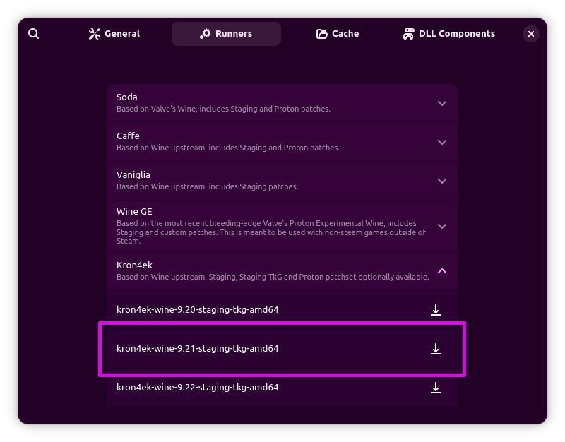
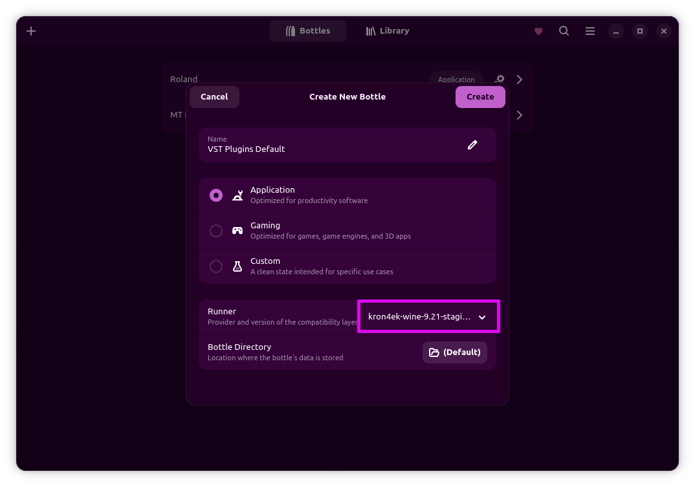
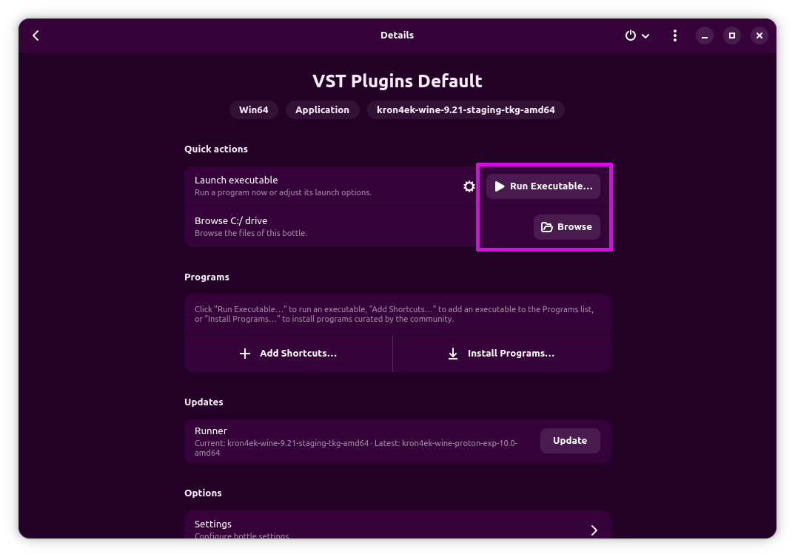

# Yabridge Bottles Wineloader

## Overview

When using Yabridge to run VST plugins with WINE, users typically rely on the system version of WINE.
However, many users prefer utilizing Bottles, an application designed to manage WINE prefix directories in a more user-friendly way.
There is only one limitation with this approach: some of the key settings in Bottles, specifically for choosing the WINE variant and version, become ineffective as the system WINE is used instead.

## Project Purpose

This repository hosts a script that addresses this issue by enabling seamless integration between Yabridge and Bottles.
With this script, users can effectively leverage the capabilities of Bottles to select their desired WINE variant and version.

## Installation

### Install Bottles
If your distribution provides packages, you can use those; otherwise, install [Bottles](https://flathub.org/en/apps/com.usebottles.bottles) from Flatpak. Sandboxing will not be used, so it doesn't matter. Both your DAW and yabridge must be installed outside of Flatpak, otherwise, it won't work.

### Install Yabridge
Yabridge [README](https://github.com/robbert-vdh/yabridge) has installation instructions for many Linux distributions. Check these for the recommended installation procedure. Since we plan to use Bottles, the WINE-related parts can be skipped.

### Install `yq`

#### Arch Linux
You can install `yq` from the Arch User Repository (AUR) using `yay`:

```bash
yay -S yq
```

#### Debian/Ubuntu
For Debian and Ubuntu, you can install `yq` using the apt package manager.
```bash
sudo apt install yq
```

#### Fedora
You can install `yq` using the DNF package manager:

```bash
sudo dnf install yq
```

### Download and install wineloader script
Create the directory ``~/.local/bin`` if it does not exist, then move the downloaded script to ``~/.local/bin/wineloader.sh``:

```bash
mkdir -p ~/.local/bin
mv ~/Downloads/wineloader.sh ~/.local/bin/wineloader.sh
chmod +x ~/.local/bin/wineloader.sh
```

### Create a systemd user environment variable
Create the directory ``~/.config/environment.d`` if it does not exist, then place the file ``wineloader.conf`` inside.

#### Reboot

## Usage
* Install a runner. With stable yabridge 5.1.1, and until issue #382 is fixed, I recommend using kron4ek-wine-9.21-staging-tkg-amd64.
  
* Create a Bottle for your plugins. You will likely end up with multiple Bottles using different settings, but let's start with a default one, e.g., "VST Plugins Default."
  
* After selecting the Bottle from the list and opening it, you can use:
  
  - the "Run Executable..." button to install plugins that come with an installer,
  - the "Browse" button to navigate to C:\Program Files\Common Files\VST3\ and add your VST3 plugins there if there's no installer.
    Also, browse this folder and copy its path. When using Flatpak Bottles, the path will look like this:
    
    ``/home/username/.var/app/com.usebottles.bottles/data/bottles/bottles/VST-Plugins-Default/drive_c/Program Files/Common Files/VST3``
    
    Otherwise, it will probably be:
    
    ``/home/username/.local/share/bottles/bottles/VST-Plugins-Default/drive_c/Program Files/Common Files/VST3``
    
    
* Open a terminal and run these commands (use the path you created and copied earlier; paste the path in double quotes or escape it properly):

```bash
yabridgectl add "/home/username/.var/app/com.usebottles.bottles/data/bottles/bottles/VST-Plugins-Default/drive_c/Program Files/Common Files/VST3"
yabridgectl sync
```
* Trigger a plugin rescan in your DAW. Enjoy!
